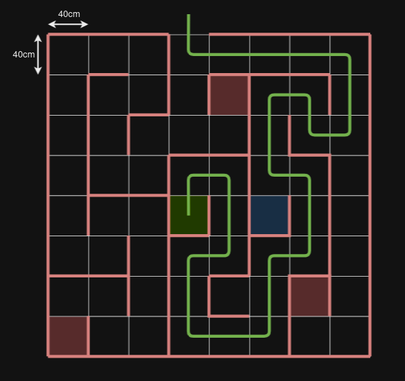

# Final Exam - Maze Escape

Responsible: Ing. Adam Ligocki, Ph.D.

The final exam is organized as a competition. Each team has 3 attempts to escape the maze with their robot, using the robot's full sensor capabilities. The score for the exam is based on the best of the three attempts.
 - The robot starts inside the maze, in the center of the starting cell.
 - There is only one optimal escape path from the maze.
 - The maze contains no loops.
 - There are 3 randomly placed minotaurs and 1 treasure.
   - Each encounter with a minotaur results in a 30 seconds penalty.
   - Finding the treasure reduces the final time by 30 seconds.
 - The maze consists of 8x8 cells, with each cell measuring 40x40 cm. Black lines on the floor mark the boundaries between cells.
 - ArUco tags will be placed on the maze ground, providing hints about the escape route, the presence of minotaurs, or the path to the treasure.

In total for final exam the team can earn up to 50 points
 - Maze escape up to 40 points
   - The formula for calculating the score is: `y=min(max(kx+q),0,40)`
 - Git and project documentation quality gives up to 10 points

## Attempt Rules

 - Teams have at least 45 minutes between attempts to modify their program.
 - The code used during the competition must be uploaded to Git by 11:59 PM on the same day.
 - The competition code must not contain specific information about the maze (e.g., paths, minotaur locations, etc.). Pre-known information, such as cell size, may be included.
 - Wall touching not allowed

## Maze Example
 - Walls - red lines
 - Escape path - green line
 - Start - green cell
 - Treasure (bonus) - blue cell
 - Minotaur (penalty) - red cell

