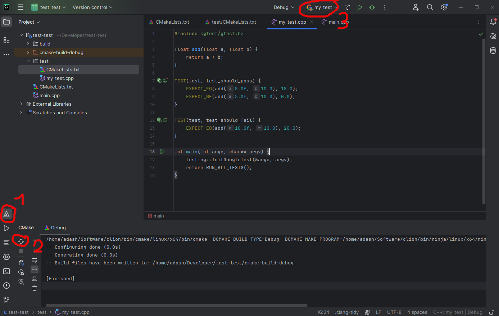

# Lab 2 - C++, CMake & IDE

Responsible: Ing. Adam Ligocki, Ph.D.


If you are not familiar with Linux CLI commands, please follow the [Linux](../../4_others/text/1_linux.md) chapter.

## CLI Compilation (30 min)

This exercise will show you how to write and compile the most basic c++ project in Linux OS.

In your home directory create a project folder and enter it.

Write a simple program into the `main.cpp` file.

```c++
#include <iostream>

#define A 5

int sum(int a, int b) {
    return a + b;
}

int main() {
    std::cout << "My Cool CLI Compiled Program" << std::endl;
    int b = 10;
    std::cout << "Sum result: " << sum(A, b) << std::endl;
    return 0;
}
```

Save file and compile it using the `gcc` call ([GCC](https://gcc.gnu.org/) a C/C++ compiler). 
```shell
g++ -o my_cool_program main.cpp
```

And run binary
```shell
./my_cool_program
```

There are other alternatives, like [CLang](https://clang.llvm.org/), [LLVM](https://llvm.org/), and many [others](https://en.wikipedia.org/wiki/List_of_compilers#C++_compilers)

### Challenge 1 

 - In your project folder, create and `include` folder
 - in the `include` folder create and `lib.hpp` file and write some function into it
 - use the function from `lib.hpp` in the `main.cpp`
 - compile and run program (tip: use `-I <folder>` argument for `gcc` to specify folder with header files)

### Challenge 2
 
 - in the projet folder create the `lib.cpp`
 - move the function implementation from `lib.hpp` to `lib.cpp`; keep function declaration in `lib.hpp`
 - compile and run program (tip: you have to compile both `main.cpp` and `lib.cpp`)
 - helper: `gcc -o <output_binary> <source_1.cpp source_2.cpp ...> -I <folder_with_headers>`
 - Discuss the difference between preprocessing code, compiling code and linking objects.

 - Delete project folder

## CMake Project (30 min)

Before reading following text, please get familiar with [CMake](../../4_others/text/7_cmake.md).

Now let's create a similar project, but using `CMake`.

 - Determine your current location in the file system.
 - Switch to your home directory.
 - Create a new project folder.
 - Inside this folder, create several subdirectories so that the structure looks like this (use the tree command to verify):

```
/MyProject
 |--build
 |--include
 | \--MyProject
 \--src
```

 - Using any text editor (like `nano` or `vim`) to create the following files: `main.cpp`, `lib.cpp`, `lib.hpp`, and `CMakeLists.txt` in your `home directory`. 
 - Move (do not copy) the `main.cpp` adn `lib.cpp` files into the `src` subdirectory.
 - Move the `lib.hpp` file into the `include/MyProject` subdirectory.
 - Move the `CMakeLists.txt` file into the root of the project folder.

Now your project should look like this:
```
/MyProject
 |--build
 |--CMakeLists.txt
 |--include
 | \--MyProject
 |   \--lib.hpp
 \--src
   |--lib.cpp
   \--main.cpp
   
```

 - Using text editor fill the `main.cpp`, `lib.cpp` and `lib.hpp` files with required code.
 - Using the text editor fill the `CMakeLists.txt`

```cmake
cmake_minimum_required(VERSION 3.10)
project(MyProject)
set(CMAKE_CXX_STANDARD 17)
include_directories(include/)
add_executable(my_program src/main.cpp src/lib.cpp)
```

Optional: try to compile program manualy.

```shell
g++ <source1 source2 source3 ...> -I <include_directory> -o <output_binary>
```

 - Delete project folder 

## CLion IDE (30 min)

Create a same project using the CLion IDE. 

To learn how to control CLion, please take a look on [tutorial](../../4_others/text/4_clion.md) or [official doc](https://www.jetbrains.com/help/clion/clion-quick-start-guide.html#code-assistance).

## Unit Tests, GTest (30 min)

The unit tests are an effective way of developing software. It is called test-oriented-development. First we define the required functionality, than we write a tests that covers requirements and finally we implement the algorithms. When the tests are passing, it means we fulfilled requirements.

In the same time, if we work on large scale projects where many people cooperates and many changes are done, the unit tests allows us to trace the potential bugs that might be introduced with changes. It is called Continuous Integration (CI). 

There are many frameworks that helps implement testing. In this course we are going to use the GTest by Google as it is one of the most common tool in this field.

### GTest Installation

If there is no GTest installed on the system follow these instructions.

```shell
# install necessary packages 
sudo apt update
sudo apt install cmake build-essential libgtest-dev

# compile gtest
cd /usr/src/gtest
sudo cmake .
sudo make

# install libs into system
sudo cp lib/*.a /usr/lib
```

Take a look if the libraries are in the system

```shell
ls /usr/lib | grep gtest

# you shoul see:
# libgtest.a
# libgtest_main.a
```

### Adding Unit Test to Project

In your project directory add the `test` folder.

```
/MyProject
 |--include
 |--src
 \--test
```

Add the `add_directory(test)` line at the end of `CMakeLists.txt` file.

Create `CMakeLists.txt` file in the `test` folder.

```cmake
cmake_minimum_required(VERSION 3.10)

find_package(GTest REQUIRED)
enable_testing()

add_executable(my_test my_test.cpp)
target_link_libraries(my_test GTest::GTest GTest::Main)
gtest_discover_tests(my_test)
```

Create `my_test.cpp` file.

```c++
#include <gtest/gtest.h>

float add(float a, float b) {
    return a + b;
}

TEST(test, test_should_pass) {
    EXPECT_EQ(add(5.0f, 10.0), 15.0);
    EXPECT_NE(add(5.0f, 10.0), 0.0);
}

TEST(test, test_should_fail) {
    EXPECT_EQ(add(10.0f, 10.0), 20.0);
}

int main(int argc, char** argv) {
    testing::InitGoogleTest(&argc, argv);
    return RUN_ALL_TESTS();
}
```

In the bottom of the CLion open console and run

```shell
mkdir build && cd build
cmake ..
make
ctest
```

You should see the test evaluation.

You can also evaluate tests in directly in the CLion by reloading the CMake and the test will be available as an executable on the top of the window.



## C++ Trainig (2h)

Take a look on [basic c++ tutorial](../../4_others/text/2_cpp.md) and more advanced [multithreading tutorial](../../4_others/text/8_multithreading.md).
