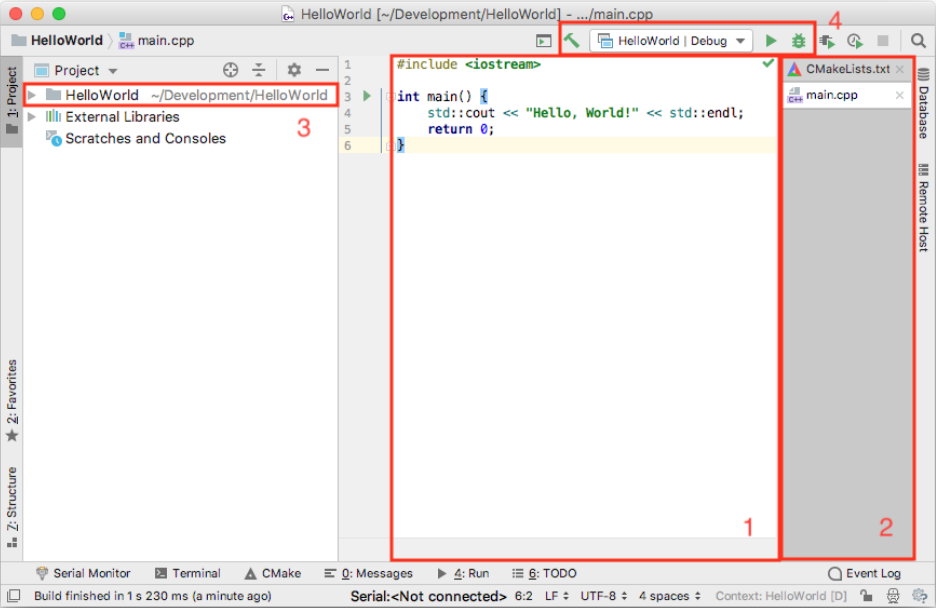
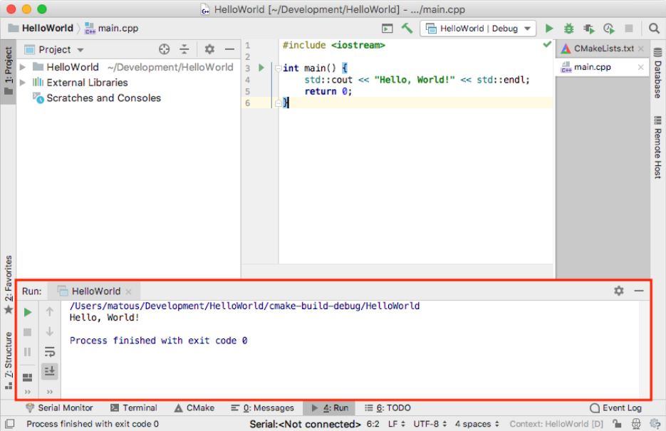
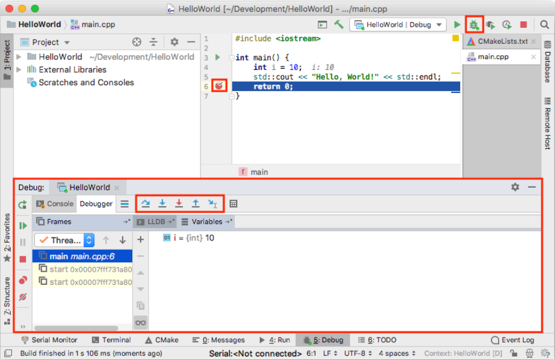

# CLion

CLion is an integrated development environment (IDE) developed by JetBrains. It offers an interesting alternative to conventional environments such as Eclipse or NetBeans.

Compared to these traditional IDEs, CLion stands out for its speed, clarity, and modern interface. Thanks to its integration with the JetBrains ecosystem, users can install numerous plugins to add support for new languages, developer tools, and more. Another significant advantage is its built-in support for Git.

This manual discusses the use of CLion in the context of the BPC-PRP course. The manual begins with a brief overview of the CMake build system.

Following this, the manual focuses on CLion itself, including instructions for installation, creating a simple "Hello World" project, and getting it running.

The examples in this manual were prepared using CLion version 2018.3, so some procedures may change in future versions.

## CLion Installation

To install CLion, download the installation package from [https://www.jetbrains.com/clion/](https://www.jetbrains.com/clion/) by clicking on "GET FREE 30 DAY TRIAL."  
Students are eligible for free use of the full version throughout their studies, which applies to all JetBrains products. You can obtain the full version by following the instructions on [https://www.jetbrains.com/student/](https://www.jetbrains.com/student/).  
After downloading the installation package, proceed with the installation in the standard way according to the conventions of your operating system.

## Hello World Project

First, we will create a simple Hello World project to familiarize ourselves with the process of project creation, the environment, and development on a local computer.  

When launching CLion, you will be greeted with a welcome screen listing your recently opened projects. Click on the "New Project" button to start.

After clicking, a window for configuring the new project will open. Here, you can set the path where you want the project to be created and choose the C++ language standard, which in our case is C++17.

After clicking "Create," the development environment will open, as shown in the image below.

Let’s take a closer look at what’s on the screen.

1. **Pane with the currently edited source code**
2. **Currently opened files**
3. **Files in the project**
4. **From left to right:** project compilation, target selection, compile and run, compile and run in debug mode.

When program is started, the console appears.

If porogram debug started, the debug console and related controls appears.

## Integrated Tutorial

The current CLion version contains the onboarding tutorial. Follow it to learn more.

