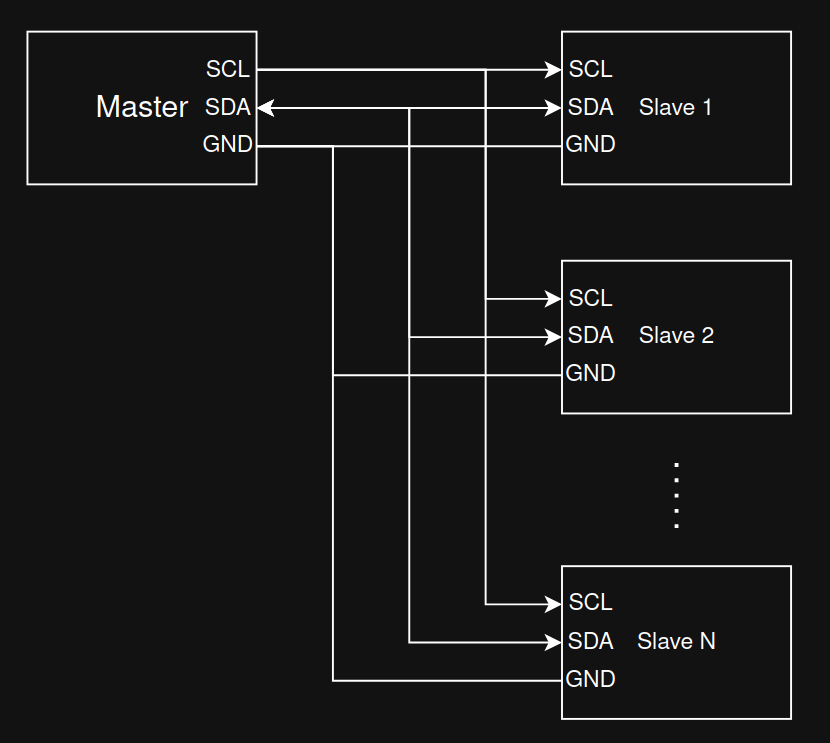

# Communication Buses

## UART

A UART (Universal Asynchronous Receiver/Transmitter) is a simple device used to send and receive data in a serial format. This means it sends information one bit at a time, rather than sending multiple bits at once. It is found in many microcontrollers and computers because it is easy to use and does not require many wires.

UART topology:

With UART, the sender and receiver do not share a special clock line. Instead, both sides must agree on a speed called the baud rate. This speed decides how many bits per second they will send or receive. If both sides use the same speed, data moves from one device to the other without confusion.

A UART usually has two main lines for data: TX (transmit) and RX (receive). When one device transmits through TX, the other device reads the signal on its RX pin. To avoid errors, UART systems often include extra settings such as start bits, stop bits, and parity bits. These help confirm that each bit is received in the correct order.

Although UART is slower than some other communication methods, it is very popular. It requires few pins, is easy to set up, and works well for many simple and medium-speed data transfers.

UART timing:

image source: https://vanhunteradams.com/Protocols/UART/UART.html

## I2C

I2C (Inter-Integrated Circuit) is a simple method for digital devices to talk to each other using just two wires. One wire is called SDA, which carries data. The other wire is called SCL, which provides the clock signal. In I2C, devices use this clock signal to stay in sync, so they can send and receive data at the right time.

I2C topology:

I2C follows a master-slave setup. The master device generates the clock signal and decides when to start or stop a communication. It also chooses which slave device to talk to by using an address. Each slave device listens for its address, then responds when asked.

Because I2C only needs two wires, it is a good choice when you want to connect multiple sensors or peripherals without adding many extra pins. It is also fairly easy to set different speeds, so you can adjust it for your needs. Common speeds are known as Standard Mode (up to 100 kHz) and Fast Mode (up to 400 kHz).

I2C is often found in microcontroller projects, temperature sensors, and various other small components. It helps keep connections simple and allows many devices to share the same two wires for data transfer.

I2C timing:

image source: https://www.youtube.com/watch?v=CAvawEcxoPU

## SPI

SPI (Serial Peripheral Interface) is a simple and fast way for digital devices to communicate using at least four main lines. The first line is SCLK (serial clock), which sets the timing for data transfers. MOSI (master out, slave in) is used by the master device to send data out to the slave. MISO (master in, slave out) is used by the slave device to send data back to the master. Finally, SS (slave select) or CS (chip select) is used by the master to choose which slave device to talk to.

SPI topology:

In an SPI setup, the master is in charge of generating the clock signal and deciding when data is sent or received. Data shifts on MOSI and MISO with each clock pulse, allowing both devices to exchange information at the same time. SPI does not use addresses like I2C, so each slave device normally has its own SS line. This can mean extra wiring if you have many devices.

SPI can run at higher speeds than many other serial interfaces, often reaching several megahertz or more. This makes it good for applications where you need fast data transfers, such as reading data from a sensor or writing to a display. Because it is straightforward and efficient, SPI is frequently used in microcontrollers, sensors, memory chips, and other peripherals that require rapid, reliable communication.

SPI timing:

imabe source: https://www.youtube.com/watch?v=0nVNwozXsIc 

## CAN

CAN (Controller Area Network) is a communication system originally designed for vehicles, allowing different parts of a car—like the engine, brakes, and airbags—to talk with each other in a reliable way. It uses two main wires, often called CAN High and CAN Low, which together form a robust bus. Unlike protocols that need a separate line for every device, CAN allows multiple nodes to share the same pair of wires.

CAN topology:

In a CAN network, any node can send a message whenever the bus is free. Each message has an identifier that shows its priority. If two nodes try to send messages at the same time, the node with the higher-priority message keeps sending, and the lower-priority message waits, ensuring important signals go first. This makes CAN useful in safety-critical systems.

CAN also includes error detection features. For example, if a node reads back a wrong bit, it flags an error and can resend the message. Because of its high reliability and simplicity, CAN is widely used not only in automobiles but also in industrial equipment, medical devices, and other areas that need dependable data sharing.

CAN data frame:

image source: https://en.wikipedia.org
