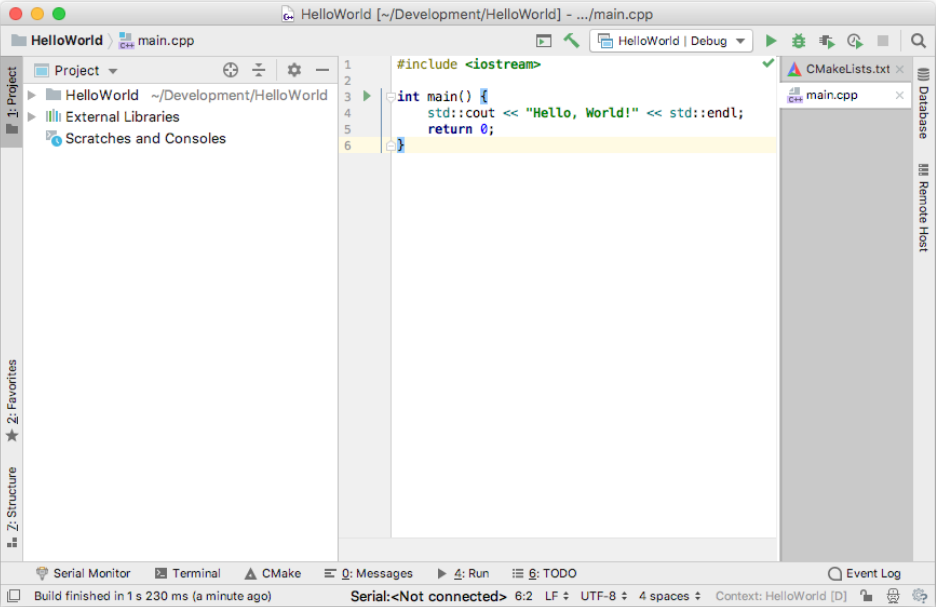
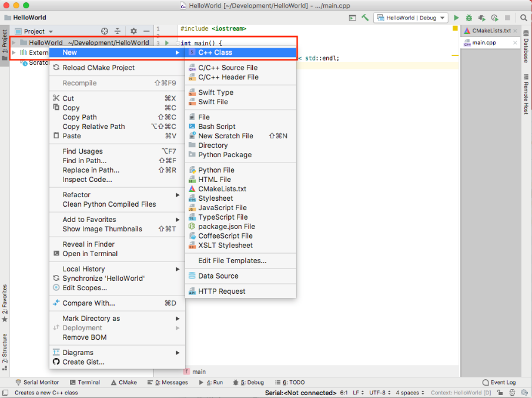
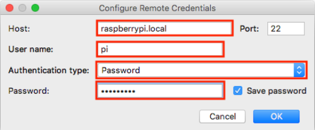
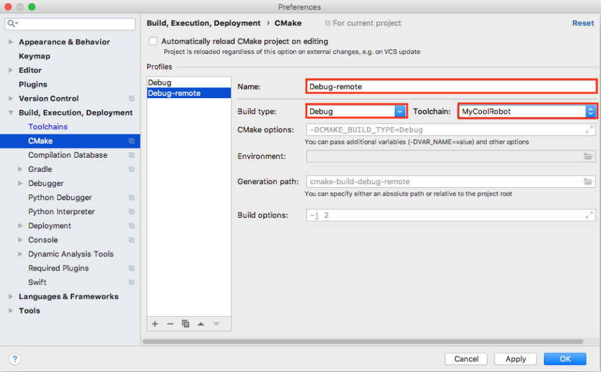

# Remote development v prostredi CLion

Clion je integrované vývojové prostředí vyvíjené firmou JetBrains. Jedná se o zajímavou alternativu ke konvenčním prostředím jako je například Eclipse nebo NetBeans.
Oproti těmto uvedeným prostředím Clion vyčnívá zejména kvůli své rychlosti, přehlednosti a modernosti. 
Díky napojení na ekosystém firmy JetBrains je možné do studia doinstalovat spoustu rozšiřujících pluginů přinášejících podporu pro nové jazyky, vývojářské nástroje atp. 
Velkou výhodou může být i integrovaná práce s Gitem.

V tomto manuálu bude rozebráno použití prostředí Clion v předmětu BPC-PRP tedy jako nástroje pro vývoj firmware mobilního robotu založeného na platformě KAMBot. 
Nejprve bude stručně rozebrán build system CMake.
Poté se manuál již bude věnovat CLionu a to zejména jeho instalaci, vytvoření jednoduchého projektu typu Hello World a jeho zprovoznení. 
Dále je popsána stěžejní kapitola tohoto manuálu, a to vzdálený vývoj umožňující vzdálené programování Raspberry Pi pomocí standardního počítače. Na konci je popsán jednoduchý projekt blikání LEDkou a kapitola zabývající se odstraňováním nejčastějších problémů se vzdáleným vývojem.

Příklady v tomto manuálu byly zpracovány ve verzi Clion 2018.3, je tedy možné, že se v budoucnosti některé postupy budou měnit.

## Build system CMake

CMake je soubor nástrojů, které zjednodušují kompilaci projektů a knihoven takovým
způsobem, aby byly nezávislé na operačním systému a kompilátoru. Funguje tak,
že pomocí jednotného konfiguračního souboru CMakeLists.txt vygeneruje Makefile
pro UNIX-like systémy a pro Windows generuje MSVC pracovní prostory. Velkou
výhodou CMake je správa závislostí - aplikace si mohou definovat na jakých knihovnách
jsou závislé, přičemž CMake kontroluje, jestli jsou tyto knihovny dostupné a navíc v
požadované verzi. Další velkou výhodou je možnost vytvářet jak spustitelné soubory
tak knihovny pomocí jedné jednoduché konfigurace umístěné v CMakeLists.txt.

Ukázkový soubor CMakeLists.txt pro aplikaci:
```cmake
cmake_minimum_required(VERSION 3.7)
project(MyCoolRobot)

set(CMAKE_CXX_STANDARD 17) 

add_executable(MyCoolRobot main.cpp)
```

Ukázkový soubor CMakeLists.txt pro knihovnu:
```cmake
cmake_minimum_required (VERSION 3.7)
project (MyCoolLibrary VERSION 0.1 LANGUAGES CXX )

include(GNUInstallDirs)
set (CMAKE_CXX_STANDARD 17)
file (GLOB SOURCES src/*.cpp )

file (GLOB HEADERS include/*.h)

add_library(libmycoollibrary ${SOURCES})

target_include_directories(libmycoollibrary PUBLIC
    $<BUILD_INTERFACE : ${CMAKE_CURRENT_SOURCE_DIR}/include> 
    $<INSTALL_INTERFACE : include>
    PRIVATE src)

install (TARGETS libmycoollibrary EXPORT MyCoolLibraryConfig
    ARCHIVE DESTINATION ${CMAKE_INSTALL_LIBDIR}
    LIBRARY DESTINATION ${CMAKE_INSTALL_LIBDIR}
    RUNTIME DESTINATION ${CMAKE_INSTALL_BINDIR})

install(DIRECTORY include/DESTINATION ${CMAKE_INSTALL_INCLUDEDIR})

install(EXPORT RoboUtilsConfig DESTINATION share/MyCoolLibrary/cmake)

export(TARGETS libroboutils FILE MyCoolLibraryConfig.cmake)
```

V případě, že máme nějaký projekt, který používá CMake a chceme jej spustit,
provedeme to pomocí příkazů:

```shell
cd MyCoolRobot
cmake . 
make
./MyCoolRobot
```

## Instalace CLion
Instalace CLion probíhá pomocí stažení instalačního balíčku ze stránky [https://www.jetbrains.com/clion/](https://www.jetbrains.com/clion/) po kliknutí na "GET FREE 30 DAY TRIAL".
Studenti mají nárok na bezplatné využívání plné verze po dobu studia, což se ostatně týká všech produktů firmy JetBrains. 
Získání plné verze je možné pomocí postupu na stránce [https://www.jetbrains.com/student/](https://www.jetbrains.com/student/).
Po stažení instalačního balíčku provedeme instalaci standardním způsobem podle zvyklostí jednotlivých operačních systémů.

## Hello World Projekt
Nejprve vytvoříme jednoduchý HelloWorld projekt, ve kterém se seznámíme s procesem vytvoření projektu, prostředím a vývojem na lokálním počítači. 
Po spuštění CLion nás přivítá úvodní obrazovka se seznamem naposledy otevřených projektů, kde klikneme na tlačítko "New Project".


Po kliknutí se nám otevře okno s konfigurací nového projektu, kde nastavíme cestu, kde chceme mít projekt vytvořený a standard jazyka C++, v našempřípadě C++17.


Po kliknutí na "Create" nás přivítá samotné vývojové prostředí tak jak je zobrazeno na obrazku.



Pojďme se nyní podívat, co se na obrazovce nachází.


1. podokno s aktuálně editovaným zdrojovým kódem
2. aktuálně otevřené soubory
3. soubory v projektu
4. zleva: kompilace projektu, výběr targetu, kompilace a spuštění, kompilace aspuštění v debug módu

Verze CMake dodávaná v Raspbianu je bohužel relativně stará, zatím co CLion předpokládá použití relativně novou verzi, pro vyřešení tohoto problému je nutné změnit v souboru CMakeLists.txt verzi CMake z 3.12 na 3.7 tak jak je zobrazeno ve výpisu:

NOTE: Dnes jiz pravdepodobne neplati a Raspbian obsahuje znatelne novejsi verzi CMake.
```cmake
cmake_minimum_required(VERSION  3.7)
project(HelloWorld)
set(CMAKE_CXX_STANDARD  14)
add_executable(HelloWorld  main.cpp)
```

Nyní klikneme na tlačítko pro kompilaci a spuštění, kdy se nám nejprve ve spodní části obrazovky zobrazí okno s průběhem kompilace a následně s konzolí spuštěného programu:


Při debugování se breakpointy přidávají kliknutím vedle čísla řádku. 
Po přidání breakpointu je nutné program spustit v debug módu v horní části okna. 
Po kompilacise ve spodní části zobrazí okno debuggeru. 
Navigace v debuggovaném kódu probíhá pomocí šipek v debuggovacím okně.


Pro přidání nové třídy do projektu klikneme v podokně se soubory projektu na náš projekt pravým tlačítkem, najedeme na "New" a tam zvolíme "C/C++ Class", jak je zobrazeno na obrázku. 
Při přidávání a odebírání souborů je nutné, aby všechny `.cpp` soubory byly uvedeny v CMakeLists.txt.



CLion obsahuje spoustu funkcí a možností, jejichž popsání je zcela nad rámec tohoto návodu, doporučuji tedy si s ním pohrát a vyzkoušet, co všechno se v něm dá dělat a jak efektivně. 
Dobré je rovněž si všímat toho, když je řádek označený žlutě, většinou se jedná o CLion doporučující nějaké zlepšení kódu.

## Vzdálený vývoj

Vzdálený vývoj (remote development) znamená, že výpočetně náročné vývojové prostředí běží na běžném počítači, zatímco kompilace a spouštění programu probíhána cílovém počítači. 
Tímto způsobem lze například velmi pohodlně programovat embedded hardware případně servery. 
Velká výhoda je, že například jde z Windows nebo MacOS programovat aplikace pro Linux, což nemusí vždy být možné kvůli chybějícím knihovnám napřiklad i2c-dev. 
Funkcionalita vzdáleného vývoje byla doprostředí CLion přidána ve verzi 2018.3.

Pro nakonfigurování vzdáleného vývoje je nutné nejprve přejít do nastaveníprostředí CLion (Preferences). 
Zde ve stromu vybereme "Build, Execution, Deployment" a položku "Toolchains" viz obrazek. 
Dále klikneme na tlačítko "+".


Následně vyplníme jméno toolchainu a volbu "System" přepneme na "RemoteHost" tak, jak je to zobrazeno na obrazku. 
Následně klepneme na ikonu složky upoložky "Credentials" a nastavíme je podle konfigurace našeho robotu. 
Pokud konfigurace Raspberry Pi nebyla měněna, lze použít hodnoty uvedené v tabulce a zobrazené na obrázku.
Na Raspberry Pi musí být povoleno SSH.




| parametr | hodnota |
| -------- | ------- |
| Host | raspberrypi.local |
| Port | 22 |
| User name | pi |
| Password | raspberry |

Po kliknutí na OK, se CLion pokusí připojit k danému Raspberry Pi a zkontroluje,zda jsou všechny potřebné programy k dispozici. 
Připojování je vidět na obrazku a úspěšné připojení je vidět na dalsim obrazku.


Dalším důležitým krokem je konfigurace CMake, ta se provádí rovněž v okně Preferences tak jak je zobrazeno na obrazku.


Po kliknutí na "+" nakonfigurujeme CMake tak aby používal náš nový toolchain,tak jak je to zobrazeno na obrázku a klikneme na OK.



Po kliknutí na OK proběhne upload souborů na Raspberry Pi, po uploadu je nutné přepnout konfiguraci CMake na naši nově vytvořenou jak je zobrazenona obrazku.


Poté následuje reload konfigurace jak je zobrazeno na obrazku.


Po kliknutí na tlačítko kompilace a spuštění se náš firmware zkompiluje naRaspberry Pi a spustí se, tak jak je vidět na obrazku, kdy úspěch poznáme podle toho, že se spustitelný soubor spouští z adresáře tmp.


Vzdálený vývoj je nyní nakonfigurován a měl by fungovat téměř bez problémů, častým problémům je věnována kapitola Troubleshooting.

## Troubleshooting
V této kapitole bude rozebráno řešení problémů vznikajících při použití vzdáleného vývoje.

### CMake 3.12 is required. You are running version 3.7.2
Problém je ve vašem CMakeLists.txt, změňte parametr "cmake_minimum_required".

### V Raspberry Pi chybí požadované soubory
Po kliknuti na slozku projektu v levem panelu, kliknete na "Deployment", "Upload to" a vyberte Raspberry Pi.

### Ultimátní řešení problémů
Zkontrolujte, jestli v CMakeLists.txt jsou uvedeny všechny soubory, které se mají kompilovat. 
Zkuste v podokně CMake provést reload, jak je zobrazeno na obrazku. 
Pokud to nepomůže, přes SSH se připojte k Raspberry Pi, v /tmp smažte momentálně používanou složku pro vzdálený vývoj, restartujte CLion.

