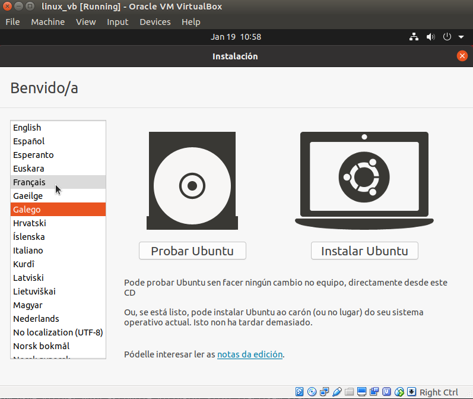
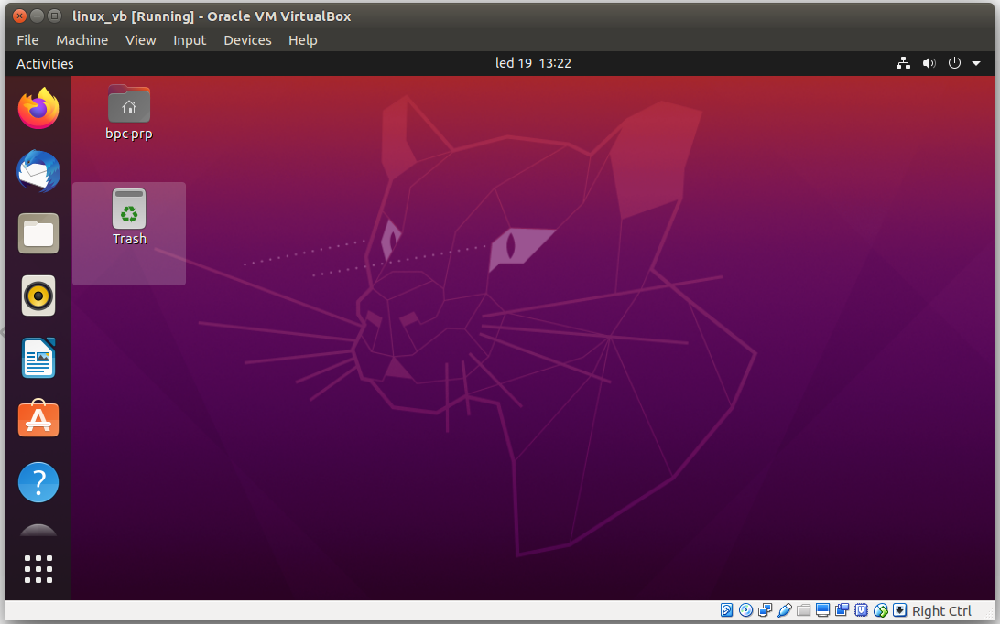

# Příprava prostředí

V této kapitole stručně probereme, jak si připravit počítač tak, aby bylo možné začít vyvíjet kód pro BPC-PRP projekt.

V ideálním případě si nainstalujte Linux přímo na Váš počítač, případně je možné jej nainstalovat do virtuálního stroje.

## Instalace VirtualBoxu

VirtualBox si nainstalujte podle návodu na příslušném operačním systému.

Postup pro [Windows a Mac](https://www.virtualbox.org/wiki/Downloads).

Pro Linux instalace záleží na distribuci a používaném baličkovacím systému. Na Debianu použijte příkaz "sudo apt install virtualbox". Poté bude možné VB aktivovat z terminálu voláním "virtualbox", nebo skrze ikonku v seznamu nainstalovaných programů.

## Instalace Linuxu

Stáhněte si obraz instalačního disku [Ubuntu 20.04](https://ubuntu.com/download/desktop).

Pomocí tlačítka "New" vytvořte nový virtuální stroj. Pojmenujte si jej, zvolte typ operačního systému, nastavte velikost operační paměti (vhodné 4GB a více), vytvořte nový virtuální disk, vyberte typ virtuálního disku (VDI), zvolte dynamickou alokaci disku a na poslední obrazovce vyberte umístění virtuálního disku na svém počítači a zvolte maximální možnou velikost virtuálního disku (10 - 20GB).

Nyní v hlavní obrazovce Virtual Boxu zvolte nově vytvořený virtuální stroj a přejděte do nastavení.

V záložce "System" můžete měnit velikost dedikované operační paměti, měnit počet jader procesorů, která budou pro virtuální stroj dostupná a také můžete zapínat/vypínat HW akceleraci pro virtuální stroj.

Dále v záložce "Display" světšete množství dedikované video paměti na maximum (128MB).

V záložce "Storage" klikněte na položku s obrázkem CD a následně úplně v pravo klikněte pravým na ikonku CD s malou šipečkou. Tím otevřete okno pro nastavení cesty k instalačnímu obrazu Ubuntu, které jsme dříve stáhli na počítač. Zavřete nastavení tlačítkem OK.

Nyní v hlavním okně Virtual Boxu aktivujte virtuální stroj tlačítkem start.

Pokud je vše nastaveno korektně, stroj nabootuje z instalačního obrazu.

Zvolte jazyk operačního systému (doporučeno angličtinu), zvolte rozložení klávesnice (doporučeno English US), a nechte pokračovat "Normal Installation".

Dále se Vás proces dotáže, zda chcete "Smazat disk a nainstalovat Ubuntu". Pokud nemáte konkrétní přání, jak si nastavit rozložení na disku, souhlaste s touto volbou. Systém Vám vypíše způsob, jakým rozdělí disk. Souhlaste.

Nyní zvolte časové pásmo a dále si vytvořte účet s heslem.

A dále už jen počkejte, až se systém doinstaluje a provede se reset virtuálního stoje.

Po opětovném nabootování v horní liště okna virtuálního stroje zvolte záložku "Devices" a "Insert Guest Additions CD Image". Za okamžik vyskočí okno, které se dotáže zda má aktivovat autorun vloženého CD. Souhlaste. Systém si vyžádá heslo a poté se doinstalují ovladače pro virtualizovaný hardware.

Po dalším sestartu máte připarevený virtuální stroj s nainstalovaným Linuxem Ubuntu 20.04.

Jako alternativu si stáhněte obraz virtuálního stroje s nainstalovaným Ubuntu [zde](https://drive.google.com/file/d/1kTZDLVTljSmCJOvL0AAAgZzEql6RpVrq/view?usp=sharing).

## Instalace ROS

Instalaci ROSu na nově nainstalovaný Linux proveďte pomocí návodu popsaného v kiapitole [Robotic Operating System](ros.md).

## CLion

CLion si do nově nainstalovaného systému stáhněte z oficiálních stránek (viz [CLion](clion.md))

## Stažení projektu z Git repozitáře

DOPLNIT GIT
